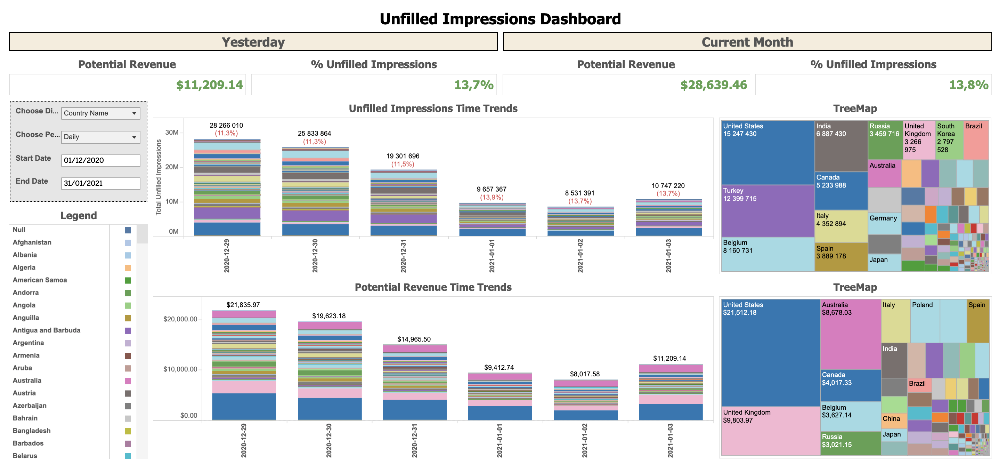

# Create Unfilled Impressions Report Project
> Data Scientist at Investing.com since March 2019

This directory was created to identify the unfilled impressions that could potentially generate money.


Source: Tableau

## Installing / Getting started

The minimal requirements are pip and Python v 3.7.

## Developing / Publishing

Here's a brief intro about what you must do in order to start developing
the project further:

```shell
git clone https://github.com/quentinb28/investingcom.git
cd investingcom/create_unf_imps_report
git checkout your_branch
BRING YOUR AMAZING IDEAS!
git add your_changes
git commit -m 'added your_changes'
git push
```

## Features
- get unfilled impressions report from Google Ad Manager (GAM)
- compute Site Geo eCPMs over the last 30 days
- compute potential revenue loss (unfilled impressions * eCPMs)
- save to Google Big Query as unfilled_imps_report_yesterday

## Contributing

If you'd like to contribute, please fork the repository and use a feature
branch. Pull requests are warmly welcome.

Please keep in mind that some of these projects might not be relevant anymore,
as our processes constantly evolve.

## Licensing

Copyright © Investing.com . All rights reserved.
